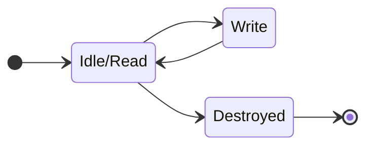

# BadAccessGuards

Finding race conditions and bad access patterns usually involves sanitizers or special programs such as Valgrind.
Those are however seldom run because they can have a heavy runtime performance cost.

This library makes it possible to detect most race conditions involving (but not only) containers through their instrumentation, at a minimal runtime cost.

As a bonus, we also get detection of memory use-after-free and corruption for free. This also detects recursive operations, which are often dangerous in containers.

# Who is this for?

- Container/library implementers
- Teams working on real-time/legacy projects
- Teams working with concurrency a lot
  - Especially with frequent onboarding of newcomers

# Goals/Features

- Easy to integrate and modify for your project
  - There are only two files: `BadAccessGuards.h` and `BadAccessGuards.cpp`
  - Licensed under the [Unlicence](LICENSE), you can just copy/modify it without worrying about legal.
  - It does not include the C++ standard library, and can thus be used in your std-free libraries (or even for a standard library implementation!)
  - Small, there are only a few platform-specific functions to implement
  - Supports MSVC, GCC and Clang.
- Detect race conditions with minimal performance impact
  - You want to be able to run this in your day-to-day development builds
  - Adds only a few load/store/masks depending on the operations
  - Fast path (read) on Windows is 2`mov`s + 1`test` + `je`
  - Debug builds were given love
  - See [Benchmarks](#Benchmarks)
- No false positives that you wouldn't want to fix
- Provide details as accurate as possible
  - We detect if the access was done from another thread, and for platforms that allow it (Windows), print its information. We also give what kind of operation it was executing.
  - Break as early as possible to hopefully be able to inspect the other threads in the debugger.
- No dependencies other than your compiler*
  - *And your platform threading libraries (non-mandatory)
  - *Does include the C standard library <stdint.h> for `uint64_t` and `uintptr_t`, and <stdarg.h> + <stdio.h> for the default `BadAccessGuardReport` function. (easily removed)
- Easy to enable/disable with a single macro: `BAD_ACCESS_GUARDS_ENABLE=0/1`. By default disabled if `defined(NDEBUG)`.
- Battle-tested: Used on projects with 200+ people running the applications/games daily.

# Non-goals/Will not implement
- Detect every single race condition without code change
  - This is not the objective of this library, you would use ThreadSanitizer, Valgrind or other tools for that. **This is not a substitute for proper design, test, and usage of sanitizers** but rather another tool in the box.
  - Some access patterns are not detected on purpose for performance.
- Detect lock-free containers issues.
  - This method cannot (unless proven otherwise) work where read/writes need to be considered atomic
- Support every platform in existance.
  - Rather than implementing them all, major ones are provided. Adding your own was made easy.
- Providing hardened versions of the `std::` containers.
  - If you want this to be supported by `std::` containers, ask your implementer to add this technique to their implementation
  - Perhaps someone could make another repository with wrappers for the `std::` containers?

# Usage

1. Set `BAD_ACCESS_GUARDS_ENABLE=1` for your **in-house** builds (you probably want it off in production...)
2. Declare the shadow memory that will hold the state and pointer to stack with `BA_GUARD_DECL(varname)`
3. For all (relevant) read operations of the container/object, use the scope guard `BA_GUARD_READ(varname)`
4. For all (relevant) write operations of the container/object, use the scope guard `BA_GUARD_WRITE(varname)`. But only if it always writes!
5. Add `BA_GUARD_DESTROY(varname)` at the beginning of the destructor
6. Enjoy!

# Examples

Examples are available in [./examples](./examples).

## Sample output:

> Run with `--break` to make this example break in the debugger.
>
>
> Testing read during write on the same thread, output:
> Recursion detected: This may lead to invalid operations
> - Parent operation: Writing.
> - This operation: Reading.
> 
> 
> Testing read during write on different threads, output:
> Race condition: Multiple threads are reading/writing to the data at the same time, potentially corrupting it!
> - Other thread: Writing (Desc=ØUnsafe WriterØ Id=18084)
> - This thread: Reading.

# How does it work?

The idea is based on the following observation:

> You do not need to catch all occurences of a race condition, catching it once should be enough when the code runs often and provides enough information to locate the issue.

Indeed, (especially in big teams), your code will be run hundreds, if not thousands, of times by your developers.  
So even if you have a 10% chance to catch the issue with useful details, it is better than a 1% chance and not crashing or detecting it way later in the execution of the program. 

The point is that it is better than not being detected at all. And better than having people run sanitizers once every moon eclipse, or only on small unit tests, or worse, never.

## Detection

So our objective is to detect race conditions, as fast as possible. And we do not need 100% detection as long as developers can afford to run their code with theses tests.

### Access states

We have 3 possible access states for a given object:

- **Idle / Read**: We're either reading the object or not using it at all. These two states are merged because you do not want your reads to be costly!
- **Write**: We're mutating the object. As soon as we are done, we go back to the **Idle** state.
- **Destroy**: The object has been destroyed (or freed), and should not be used anymore.

And there's an implicit one: **Corrupted**, if we see a value not in the list above.

### Access states transitions

Now that we have the above states, let's consider the following operations:

- A **Read** is only allowed if the previous state was **Idle / Read** too. Otherwise, the previous operation was not complete.
  - Do not change the state
- Starting a **Write** operation is allowed only if the previous state is **Idle / Read**. 
  - Change state to **Write** 
- After a **Write** operation, we can check that we were still in the **Write** state, then change it back to **Idle / Read**.
- A **Destroy** is allowed only if the previous state is **Idle / Read**.

That's it! Now all we need to do is to check those invariants. If the operations are executed on a single thread, those invariants cannot break.

Which means that if the invariants do not hold, something bad happened! 
There are two options:
- A race condition happened.
- Some kind of recursion happened.

And since we do not need a 100% error detection, these state changes do not need to be atomic. We just want to force the reads and writes of the state.  
**Remember:** the invariants can not break on a single thread except in the case of a recursion!

> **Note:** We do not care about potential reorders of the operations by the compiler. It must honor the invariants from a single-thread point of view.  
> The re-orders also cannot cause issues (except lowering the detection rate) in a multithread context. If it did, it would mean your synchronization is bad, which you want to detect anyway.  
> The only exception would be for lock-free containers, which are not the target of this library.

## Breaking with more details

The ideal situation would be to have all threads suspended as soon as the race condition occurs.
The next best option is the one we implement: send an interrupt for the debugger to break.

- The sooner we break, the higher your chances of breaking with the other thread at the location responsible for the race condition. 
  - This one is simple; the first thing we do when detecting a problem is to break! (See `BadAccessGuardConfig::breakASAP`)
  - The faster we can detect issues, the faster we can break. So we limit the cost of the detection.
- If we break, we want to know what thread was involved in the bad access.
  - This is necessary to know if the issue is recursion or a race condition
  - We could have used the thread ID, but this is slow to get. (and again, we want this to be fast). Instead, simply store the stack pointer. This is enough to identify a thread!
    - And if you are using fibers, well, you actually get fiber detection for free too, assuming you keep them around a bit and can list them.

## Keeping it fast and lightweight

We need to store two pieces of information:
- A pointer in the stack of the current thread
- The state.

State will fit in 2 bits, which is lower than the alignment of the stack address and size on virtually every platform.

So we only need to drop the lowest 2 bits of the pointer and store the state there!

> On *Windows*, all stacks are paged aligned (4kB). So we can actually drop the 8 lower bits. This way to get the state the compiler only needs to load a byte instead of masking with `0b11`. 

As for how to obtain our pointer to the current stack... we use intrinsics (see `BA_GUARD_GET_PTR_IN_STACK`), but in theory we could use the address of any variable on the stack (but would then need to make sure the compiler does not optimize it). This is a single `mov` instruction on all platforms.

# Benchmarks

## Setup

- CPU: AMD Ryzen 7 7745HX.
- RAM settings: 5200MT/s, timings 38-38-38-75, 2channels
- CPU was stabilized at a fixed frequency of 3.49Ghz, frequency boost is disabled.

Simple benchmarks were done using `std::vector<>::push_back` since it uses the most expensive guard (write access). 
Memory is reserved upfront, and the vector is emptied at each iteration unless ` - noreserve` is mentionned, which means we freed memory after clearing. `complexityN` is the number of elements pushed per iteration.
See [./benchmarks/BenchGuardedVectorExample.cpp](./benchmarks/BenchGuardedVectorExample.cpp).

As usual for microbenchmarks, take them with a grain of salt.

## Results

See [Benchmarks.md](Benchmarks.md)

## Quick recap

- Release builds
    - `vector<uint64_t>` => +50% overhead
    - `vector<uint64_t>` - noreserve => ~10-25% overhead, depends on the growth strategy
    - `vector<uint64_t*2>` => 5% overhead
    - `vector<uint64_t*4>` => 3% overhead
    - `vector<std::string of 1 char>` => 5-7%overhead
    - clang Release `-O3` (but not `-O2` nor GCC `-O3`) seems to be the exception and shows a much bigger overhead (+100% - +150%) for types other than `std::string`
        - It seems the guards defeat some kind of optimization here
        - Did not investigate why yet
- Debug builds
    - In CMake Debug default configuration (MSVC `/Od` / clang without `-Og`)
        - Overhead is between 1% (MSVC std::string)  and 15% (the rest)
        - The base overhead of the debug mode for `std::vector` is so bad anyway (especially for non-trivial types), that you might as well just go ahead and use the guards.
        - `push_back_noguard` was added to show the overhead of the implementation of the wrapper, which should not be here if you have your own vector implementation.
    - In debug optimized (clang `-g -Og`), results are globally the same as Release builds.

This seems to be a totally acceptable overhead in most cases given the chances it has to detect issues.  
Any object containing the equivalent of two pointers will most likely see only a small decrease in performance for `push_back`.

On games for which we tested the guards, less than 2% of regression in frame duration was observed. Which makes sense, since you do not (rather, should not) spend most of your time doing operations on containers.

However, I would still recommend disabling the guards in production.

# LICENSE

This work is released under the [Unlicense](https://unlicense.org/). To sum up, this is in the public domain but you cannot hold contributors liable.
